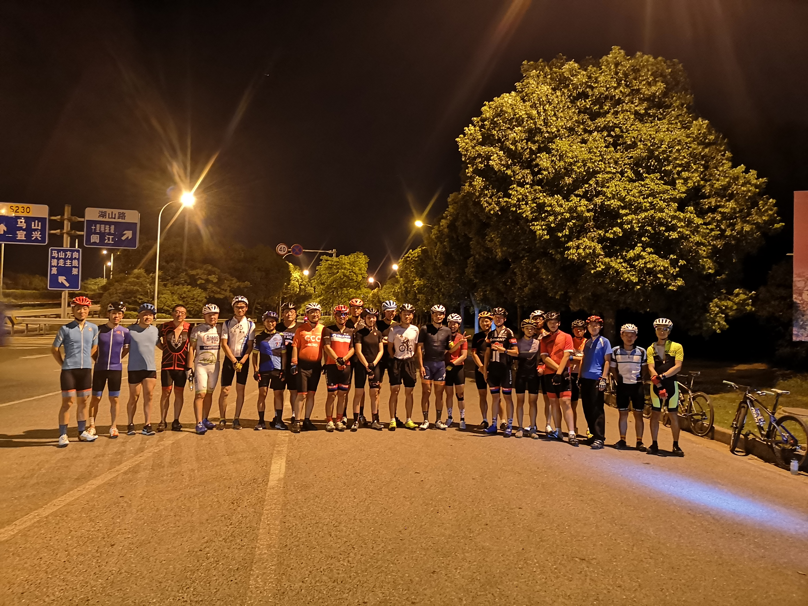
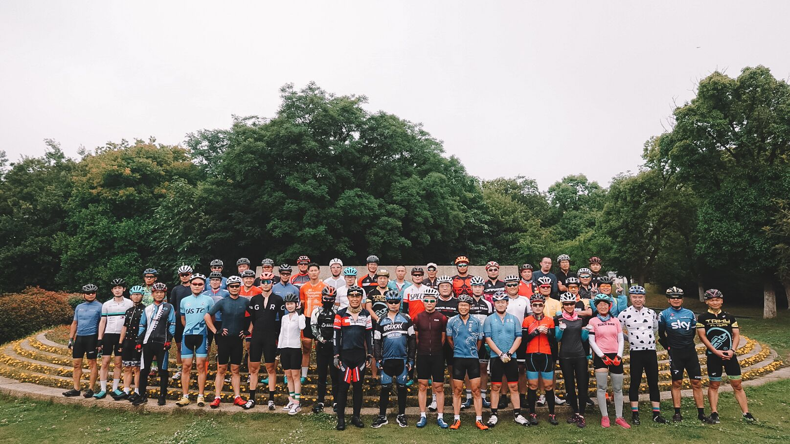
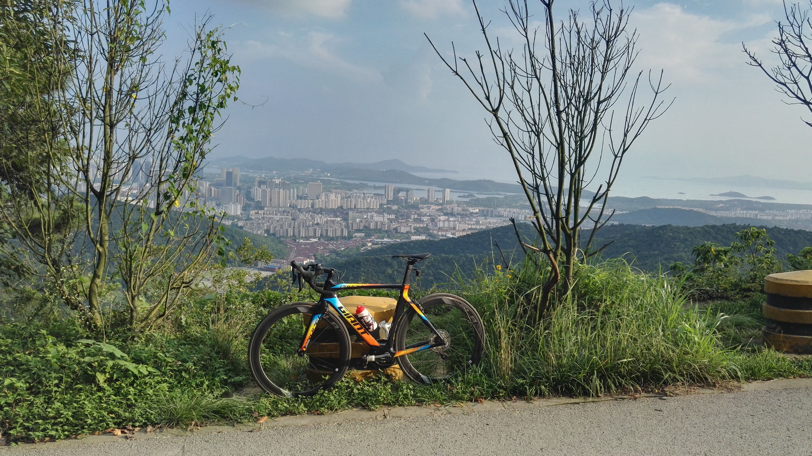
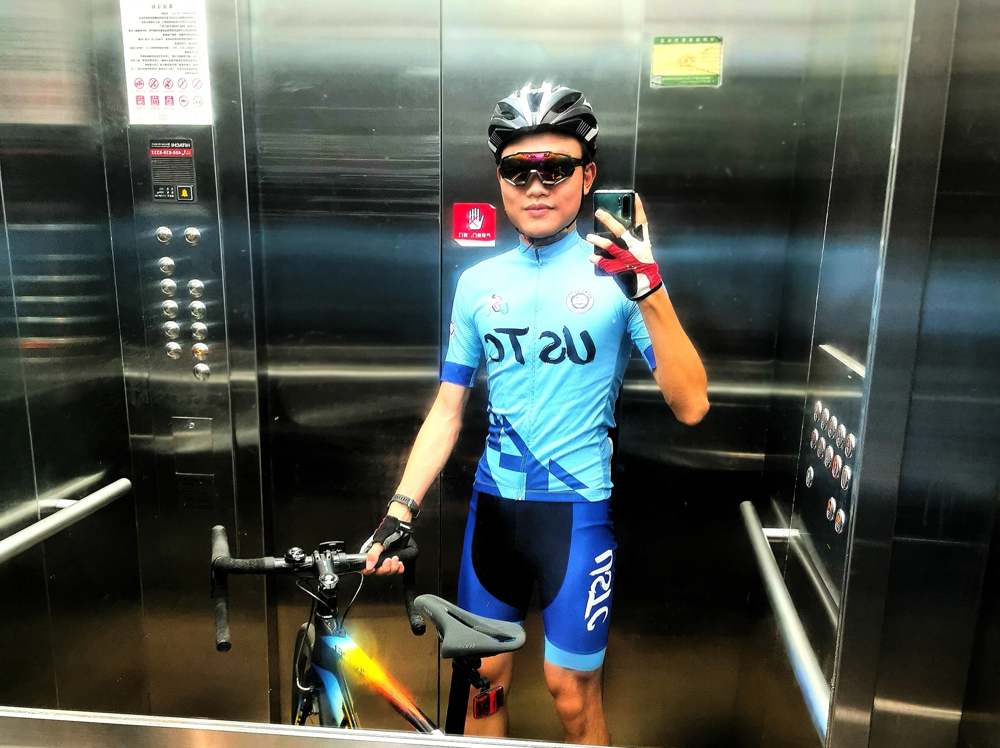
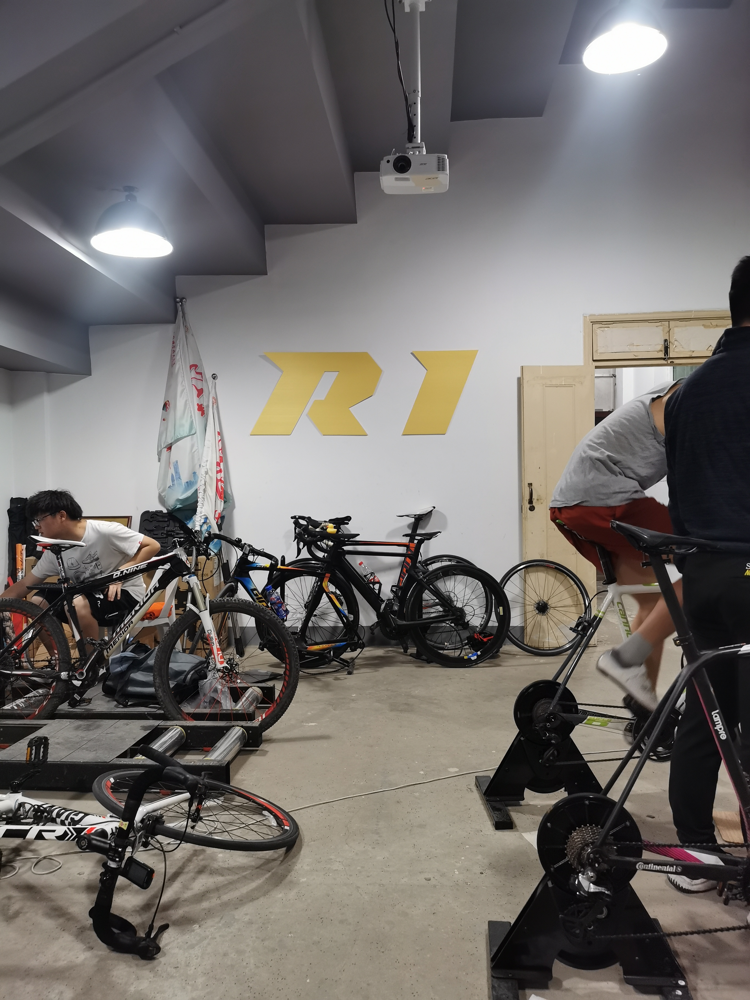
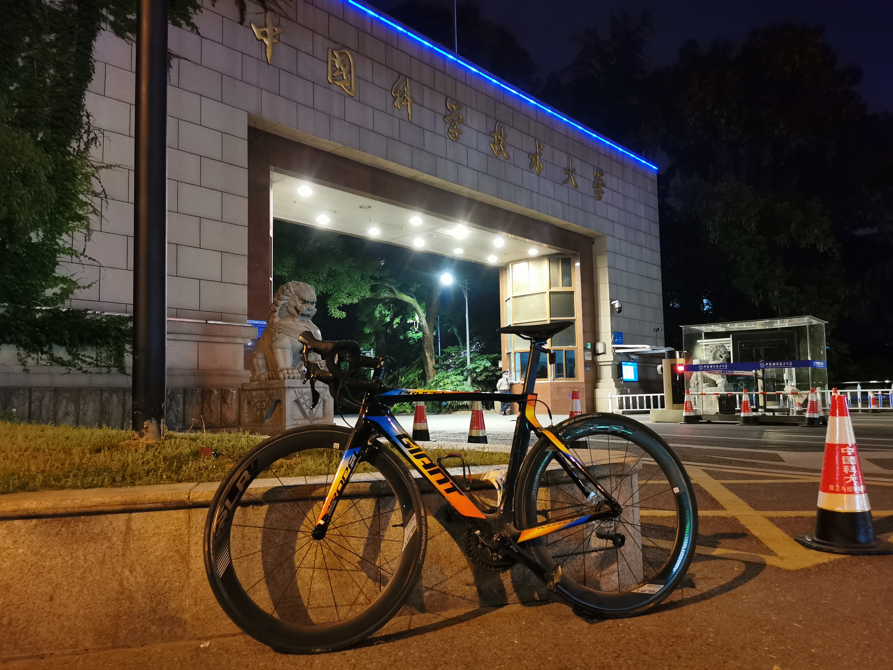

A cycling enthusiast
---

I have been enthusiastic about bicycling since middle school. In summer 2019 I bought an aerobike *Giant 2018 PROPEL ADV PRO 2*, trained a lot and made my first ITT (individual time trial) good record of covering 8.77 km with an average speed of 41.29 km/h by the Taihu Lake (China's 3rd largest freshwater lake), Wuxi on Sept. 14, 2019. After one year, a better ITT record of covering 8.77 km with an average speed of 42.44 km/h on May. 31, 2020.

    
     
    

        my record on Xingzhe APP
    

When I entered USTC in 2019, I joined the university cycling club and planned to attend a lot of cycling races and activities, with ambition and optimism. However, the Covid-19 pandemic which started in December 2019 just put the mockers on my plan, with almost all races cancelled and regular riding paused.

After one and a half year, one of my best cycling record came in April 2021, when the 1st Online National University Cycling Race was held. In the *men's one-kilometer time trial*, I finished in 1 min 24 seconds at an average power-weight ratio of 501watt/65kg and ranked 8-th. Since this race did not discriminate bewteen amateurs and professionals (in fact 5 of 7 players with rank higher than me are professionals), I am quite satisfied with this result. In the *3-kilometer team relay*, out team also ranked 8-th.

---

Pictures
---

    
    
     
    

        group photos with the local cycling clubs, by the Taihu Lake in Wuxi, summer 2019
    

    
     
    

        my bicycle on the top of the Sanmao Peak, Wuxi, summer 2019
    

    
     
    

        my bicycle at the riverside in Thirty-Peak agricultural region, Hefei, March 2022
    

In Hefei, top-left: getting ready to ride; top-right: USTC cycling club in the race; bottom-left: my aerobike at the school gate; bottom-right: a chicken guarding our bikes.

    
     
    

        getting ready to ride
    

    
     
    

        USTC cycling club
    

    
     
    

        my aerobike at the school gate
    

    
     
    

        a chicken guarding our bikes
    

