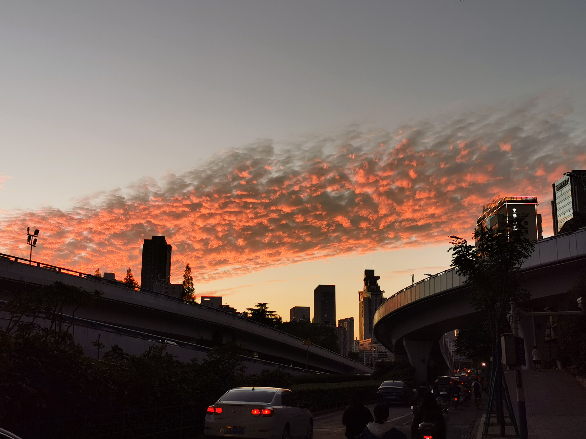

Files
===

My lecture notes (in Chinese) of *Differential Equations I* (ODEs and basic PDEs) can be viewed [here](../files/note1.pdf).

Implementation and test results of FD-WENO schemes (in Chinese) can be viewed [here](../files/demo1.pdf).

FEM homework reports can be found [HW1](../files/FEM/HW1.pdf) (1D linear element), [HW2](../files/FEM/HW2.pdf) (1D quadratic element), [HW3](../files/FEM/HW3.pdf) (1D purely Neumann BC).

Programming in numerical PDE (choronological order)
===
| PDE | method | domain | mesh | language |
| --- | --- | --- | --- | --- |
| Poisson (Dirichlet) | 2-order FD | 2D ractangle | uniform Cartesian | Matlab |
| Euler | 5-order FD-WENO | 1D interval | uniform Cartesian | Fortran |
| Navier-Stokes | 5-order FD-WENO | 2D ractangle | uniform Cartesian | Fortran + OpenMP |
| Hamilton-Jacobi | 5-order FD-WENO | 2D ractangle | uniform Cartesian | Fortran + OpenMP |
| resistive MHD | 5-order FD-HJ | 2D ractangle | uniform Cartesian | Fortran + OpenMP |
| resistive MHD | 4-order FD-HJ + Fourier | 3D toroidal with rectangular section | uniform Cylindrical | Fortran + OpenMP |
| resistive MHD | 3-order FD-HJ + Fourier | 3D toroidal with circular section | uniform Cartesian (embedded) | Fortran + OpenMP + MPI |
| ideal MHD | arbitary-degree DG (locally div-free) | 2D ractangle | arbitary Cartesian | Fortran + OpenMP + MPI |
| Poisson (Dirichlet) | arbitary-degree FEM | 1D interval | arbitary Cartesian | Matlab |
| Poisson (purely Neumann) | arbitary-degree FEM + multiplier | 1D interval | arbitary Cartesian | Matlab |
| Poisson (Dirichlet) | 2-degree FEM | 2D polygon | triangle | Matlab |

Links
===

* USTC: [en.ustc.edu.cn](https://en.ustc.edu.cn){:target="_blank"}
* SCGY, USTC: [en.scgy.ustc.edu.cn](https://en.scgy.ustc.edu.cn){:target="_blank"}
* Math, USTC: [math.ustc.edu.cn](http://math.ustc.edu.cn/ENGLISH/list.htm){:target="_blank"}
* LibGen: [libgen.gs](https://libgen.gs){:target="_blank"}
* iCourse Club, USTC: [icourse.club](https://icourse.club){:target="_blank"}
* Intel OneAPI Toolkits: [OneAPI](https://www.intel.com/content/www/us/en/developer/tools/oneapi/toolkits.html)
* S.-T. Yau College Student Mathematics Contest: [Yau-Contest](www.yau-contest.com/en)
* Warming Math Magazine (USTC Math Department): [Warming](http://staff.ustc.edu.cn/~mathsu01/pu/waming.html)
* AcademicPages (template for this website): [academicpages](https://github.com/academicpages/)

Pictures
===

    
     
    

        A photo of some cloud taken in Oct, 2021. I wonder whether it has something to do with the boundary layer turbulance?
    

    
 

---

It was wrote in the first e-mail from China in Sept. 14th, 1987: *'Across the great wall, we can reach every corner in the world.'* However, nowadays many in mainland China have difficulty crossing the *'Great Wall'*. Here are some free and helpful tools:
* For Android phones: [VPN](https://github.com/sharmajv/vpn)
* For computers: [VPN](https://github.com/Alvin9999/new-pac/wiki)
