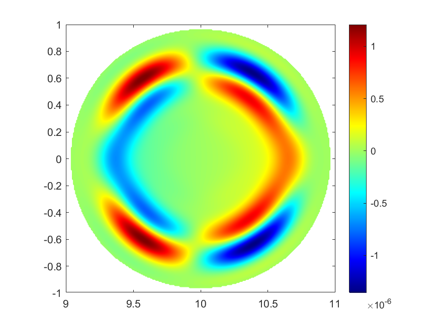

## Research interets

1. High-order numerical methods for PDEs:
   - Finite element discontinuous Galerkin methods 
   - Finite difference/volume WENO methods
   - Spectral methods
2. Scientific computing:
   - Parallel implementation of numerical solvers
   - Efficient numerical algorithms

---

## Projects

### 1. Numerical simulation of plasma equilibrium evolution in nuclear fusion

*Undergraduate Research Program at USTC*. Supervisor: Prof. Mengping Zhang.

The controlled nuclear fusion is one of the most prospective solution to the energy crisis and environmental problems. The tokamak has been widely investigated as the most feasible magnetically confined fusion device. Tearing mode instabilities have great influence on the fusion reaction thus worth stuying. In this research, in order to simulate the evolution process of tokamak plasma equilibrium numerically, we review different formulations of the MHD equations, select a suitable type of nonconservative resistive MHD that is based on perturbation and develop a parallel code using hybrid finite difference-Fourier pseudo spectral method in cylindrical coordinate. Using our code, we simulate the \((m,n)=(2,1)\) resistive tearing mode instability and compare the results against those obtained from the CLT and M3D-C1 code. The results fit well with the theory and our code exhibits satisfactory performance in maintaining numerical divergence of the magnetic field, fitting logrithmic growth rate of kinetic energy with resistivity, revealing mode structure independent of initial peturbation at the linear stage and reaching the final saturation stage.

Below is a plot of \(\widetilde{E}_{\varphi}\) (the perturbation on the toroidal component of the electric field) at time \(T=7000\), which reveals the resistive tearing mode structure and should be independent of the initial perturbation.

Below is a plot of a log-plot of kinetic energy evlolution under different resistivity. Our code reveals both the linear growing stage and the log growing rate very well.

### 2. 