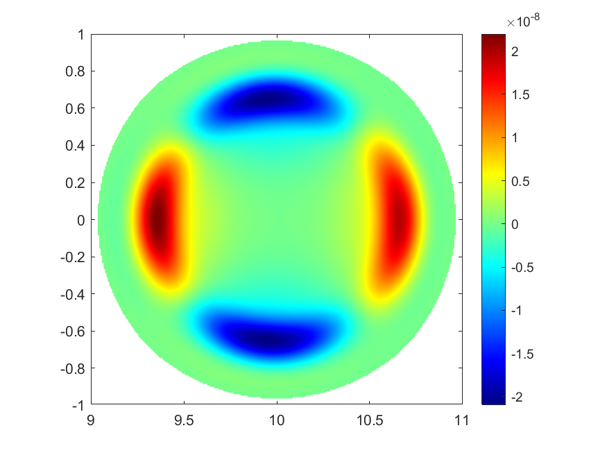
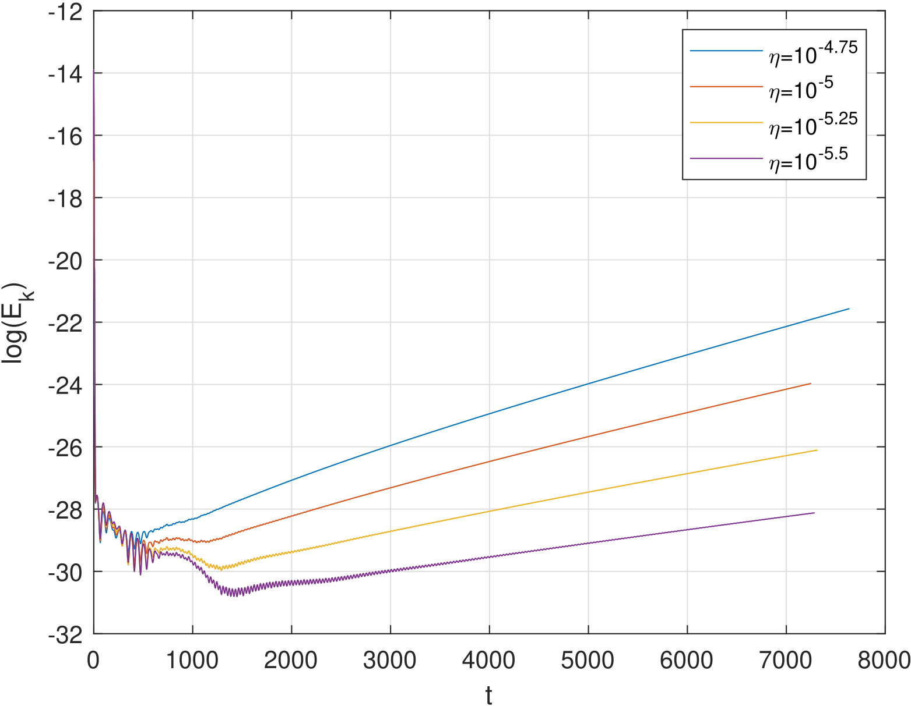
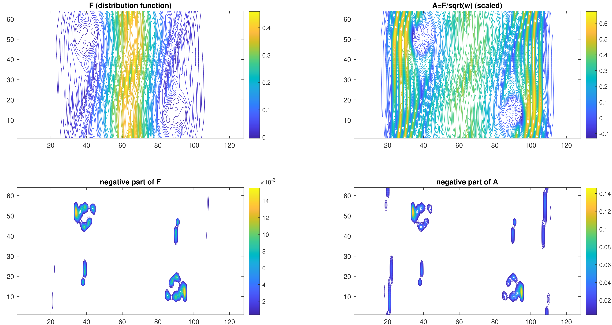
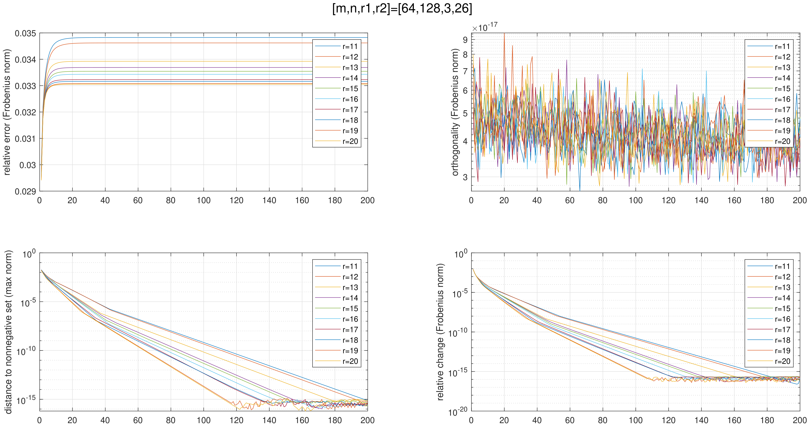
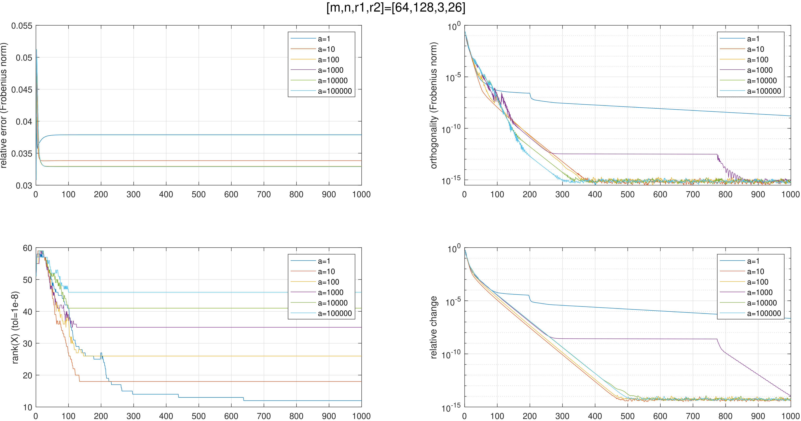

# Research interets

1. High-order numerical methods for PDEs:
   - Discontinuous Galerkin Finite element methods
   - Finite difference/volume WENO methods
   - Spectral methods
2. Scientific computing:
   - Parallel implementation of numerical solvers

---

# Projects

## 1. Numerical simulation of plasma equilibrium evolution in nuclear fusion

*Undergraduate Research Program at USTC*

Supervisor: Prof. [Mengping ZHANG](https://dsxt.ustc.edu.cn/zj_ywjs.asp?zzid=860)

July 2021 --- May 2022, USTC

Defense: Dec. 30, 2022

The controlled nuclear fusion is one of the most prospective solution to the energy crisis and environmental problems. The tokamak has been widely investigated as the most feasible magnetically confined fusion device. Tearing mode instabilities have great influence on the fusion reaction thus worth stuying.

In this research, in order to simulate the evolution process of tokamak plasma instability numerically, we reviewed different formulations of the MHD equations, selected a suitable type of nonconservative resistive MHD, and developed a parallel solver using hybrid finite difference-Fourier pseudo spectral method in cylindrical coordinates. Using our solver, we simulated the $(m,n)=(2,1)$ resistive tearing mode instability, and checked the results against those obtained from the CLT and M3D-C1 code with researchers from Institute of Plasma Physics, Chinese Academy of Science. Our solver exhibits satisfactory performance in conserving numerical divergence of the magnetic field, fitting the theoretical relation between logrithmic growth rate of kinetic energy and resistivity, revealing the tearing mode structure independent of initial peturbation at the linear stage, and reaching the final saturation stage.

Below is a plot of $\widetilde{E}_{\varphi}$ (the perturbation on the toroidal component of the electric field) at time $T=7000$, which reveals the resistive tearing mode structure and should be independent of the initial perturbation, and a log-plot of kinetic energy evolution under different resistivity. Our code reveals the linear growing stage, mode structure and the logrithmic growth rate very well.

    
    
     
    

        left: tearing mode sturtcure; right: kinetic energy
    

    
 

We virtually discussed this research with Prof. [Chi-Wang SHU](https://www.dam.brown.edu/people/shu/). Thanks for his discussion and advice.

Research report (in Chinese) preview: [here](../files/undergraduate-research-program/main.pdf); Defense PPT (in Chinese) preview: [here](../files/undergraduate-research-program/PPT.pdf).

## 2. Positivity-preserving conservative low rank methods for Vlasov dynamics

Supervisor: Prof. [Xiangxiong ZHANG](https://www.math.purdue.edu/~zhan1966/)

June 2022 --- August 2022, Purdue University (online)

The high-dimensionality of Vlasov dynamics makes it expenive to solve by traditional numerical methods. Utilizing the low-rank structure of the solution, people have developed cost-efficient methods using low-rank matrix/tensor approximation. However, very often a low-rank approximation of a given non-negative matrix (which corresponds to the solution) can have negative elements which results in non-physical solutions. In this research, our goal is to develop a cost-efficient positivity-preserving conservative low-rank method to solve this problem. We designed two algorithms, one is the tangent-space accelerated alternating projection algorithm, and the other is the nuclear norm optimization, both with macroscopic quantities conservation.

We virtually discussed this research with Prof. [Jing-Mei QIU](https://jingmeiqiu.github.io/). Thanks for her discussion and data.

    
     
    

        original data from a conservative dynamic low-rank Vlasov solver
    

    
 

    
     
    

        using tangent-space based alternating projection
    

    
 

    
     
    

        using nuclear norm minimization
    

    
 

---

Numerical PDE Programming (choronological order)
===

| PDE | method | domain | mesh | language |
| --- | --- | --- | --- | --- |
| Poisson (Dirichlet) | 2-order FD | 2D ractangle | uniform Cartesian | Matlab |
| compressible Euler | 5-order FD-WENO | 1D interval | uniform Cartesian | Fortran |
| compressible Navier-Stokes | 5-order FD-WENO | 2D ractangle | uniform Cartesian | Fortran + OpenMP |
| Hamilton-Jacobi | 5-order FD-WENO | 2D ractangle | uniform Cartesian | Fortran + OpenMP |
| compressible RMHD | 5-order FD-HJ | 2D ractangle | uniform Cartesian | Fortran + OpenMP |
| compressible RMHD | 4-order FD-HJ + Fourier | 3D toroidal with rectangular section | uniform Cylindrical | Fortran + OpenMP |
| compressible RMHD | 3-order FD-HJ + Fourier | 3D toroidal with circular section | uniform Cartesian (embedded) | Fortran + OpenMP + MPI |
| compressible MHD | arbitary-degree DG (locally div-free) | 2D ractangle | arbitary Cartesian | Fortran + OpenMP + MPI |
| Poisson (Dirichlet) | arbitary-degree FEM | 1D interval | arbitary Cartesian | Matlab |
| Poisson (purely Neumann) | arbitary-degree FEM + L-multiplier | 1D interval | arbitary Cartesian | Matlab |
| Poisson (Dirichlet) | 1,2-degree FEM | 2D polygon | triangle | Matlab |
| Poisson (Dirichlet) | LDG | 1D interval | arbitary Cartesian | Matlab |
| Poisson (Dirichlet) | HDG | 1D interval | arbitary Cartesian | Matlab |
